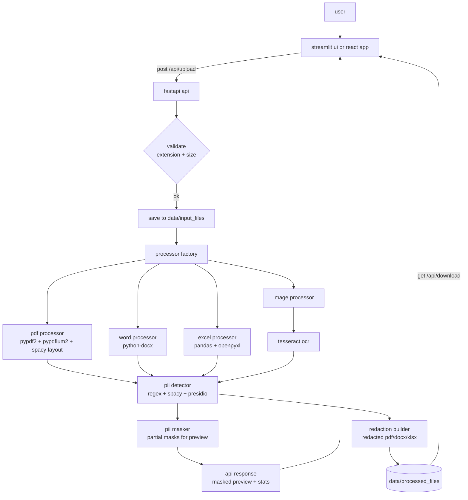

# smart-redact

a pii detection and redaction system that takes confidential documents, finds personally identifiable information in them, and produces redacted versions that are safe to share. it combines an ml leaning detection pipeline (regex patterns plus optional spacy and presidio) with per-format redaction engines that rebuild pdfs, word documents and excel files without the sensitive content, and it never sends raw pii to the browser, only partially masked previews.

## features

- multi format support. pdf, word (.docx), excel (.xlsx, .xls) and images (jpg, png, tiff, bmp) through a processor factory.
- ml based detection. regex patterns for structured pii (emails, phones, ssn, cards, ips), with optional spacy named entity recognition and presidio analyzers when the models are available.
- layout aware pdf redaction. uses spacy-layout spans and coordinate based redaction boxes so the redaction is applied at the exact position of each finding on the page.
- real redacted files. pii is blocked out in a rebuilt pdf, a rebuilt docx, or a cell-filled excel workbook, not just in the text preview.
- safe previews. the api only ever returns partially masked values (first and last characters visible, middle replaced with asterisks).
- tesseract ocr for images, with image preprocessing (grayscale, contrast and sharpening) to improve accuracy, and a mock fallback when tesseract is missing.
- file history and download endpoints for previously processed files, with cleanup of uploaded originals after processing.

## supported files

| type | extensions | extraction method |
| --- | --- | --- |
| pdf | .pdf | pypdf2 and pypdfium2, spacy-layout spans |
| word | .docx, .doc | python-docx (paragraphs and tables) |
| excel | .xlsx, .xls | pandas and openpyxl (cell by cell) |
| images | .jpg, .jpeg, .png, .tiff, .bmp | pytesseract ocr |

files up to 100 mb are accepted.

## pii types detected

- email addresses
- phone numbers
- social security numbers (ssn)
- credit card numbers
- ip addresses
- urls
- dates of birth
- passport numbers
- license plates

structured values are caught by regex with high confidence. when a spacy model (en_core_web_sm) is installed, persons, organizations, locations and dates are also flagged.

## how it works

1. the frontend uploads a file to `POST /api/upload`.
2. the api validates the extension and size, then saves the file under `data/input_files` with a unique name.
3. the processor factory picks the right processor for the file type.
4. text is extracted (directly for pdf/word, cell by cell for excel, via ocr for images).
5. the pii detector scans the text with regex and, when available, spacy and presidio. overlapping findings are merged and the best confidence wins.
6. the pii masker produces a partial mask for every finding for the preview, while the redaction builder creates the fully redacted file (coordinate redaction boxes for pdf, rebuilt docx, cell fills for excel).
7. the redacted file is saved under `data/processed_files`, the response carries the masked preview and a download link, and the uploaded original is deleted.

## architecture



## project layout

```
.
├── backend/
│   ├── app/
│   │   ├── api/                 fastapi app, upload/download/history endpoints
│   │   ├── core/                config, pii_detector, pii_masker
│   │   ├── file_processors/     base processor, factory, pdf, word, excel, image
│   │   └── utils/               upload, validation, cleanup helpers
│   ├── Dockerfile
│   └── requirements.txt
├── frontend/
│   ├── app.py                   streamlit ui
│   ├── src/                     react ui (vite + tailwind)
│   ├── nginx.conf               serves the react build and proxies /api to the backend
│   ├── Dockerfile
│   └── package.json
└── data/
    ├── input_files/             uploaded originals (cleaned up after processing)
    └── processed_files/         redacted outputs available for download
```

## tech stack

- backend: python, fastapi, uvicorn
- detection: regex, spacy, spacy-layout, microsoft presidio
- document handling: pypdf2, pypdfium2, reportlab, python-docx, pandas, openpyxl
- ocr: pytesseract, pillow
- frontend: streamlit (python) and react (vite, tailwind, gsap)
- infra: docker, nginx

## quick start

### 1. run the backend

needs python 3.11+ and tesseract on the system (for image ocr):

```bash
cd backend
pip install -r requirements.txt
uvicorn app.api.main:app --reload
```

the api is then available at http://localhost:8000 and the interactive docs at http://localhost:8000/docs.

optional: install a spacy model for named entity detection:

```bash
python -m spacy download en_core_web_sm
```

### 2. run a frontend

streamlit ui:

```bash
cd frontend
pip install -r requirements.txt
streamlit run app.py
```

the ui is available at http://localhost:8501.

react ui in dev mode:

```bash
cd frontend
npm install
npm run dev
```

the app is served by vite at http://localhost:5173.

### 3. run with docker

backend:

```bash
cd backend
docker build -t smart-redact-backend .
docker run -p 8000:8000 smart-redact-backend
```

frontend (streamlit):

```bash
cd frontend
docker build -t smart-redact-frontend .
docker run -p 8501:8501 -e BACKEND_URL=http://localhost:8000 smart-redact-frontend
```

for the react build, serve `frontend/dist` with the provided `nginx.conf`, which proxies `/api` requests to the backend.

## api endpoints

| method | path | purpose |
| --- | --- | --- |
| post | /api/upload | upload a file and get masked preview, pii statistics and a download link |
| get | /api/download/{filename} | download a redacted file from data/processed_files |
| get | /api/history | list previously processed files with metadata |
| get | /api/health | health check for containers |
| get | /health | readiness check |

## configuration

all settings live in backend/app/core/config.py, and some are overridable with environment variables:

- `HOST` and `PORT` for the uvicorn server (defaults localhost:8000)
- `DEBUG` to enable debug logging
- `MAX_FILE_SIZE` defaults to 100 mb
- `DELETE_FILES_AFTER_PROCESSING` removes uploaded originals after processing (on by default)
- `TESSERACT_CMD` is auto-detected for docker, linux and windows installs

## security notes

- the frontend never receives raw extracted text, only partially masked values.
- redacted files are the only artifacts kept, under data/processed_files.
- the download endpoint resolves paths strictly inside data/processed_files, blocking directory traversal.
- uploaded originals are deleted after processing and input filenames are replaced with uuids.

## troubleshooting

- images fail to extract text: install tesseract (`apt-get install tesseract-ocr tesseract-ocr-eng`), the mock processor will kick in until then.
- large pdfs take a while: text extraction and coordinate redaction run in parallel workers with caching.
- the frontend shows a backend error: verify the backend url matches `BACKEND_URL` (defaults to http://localhost:8000).